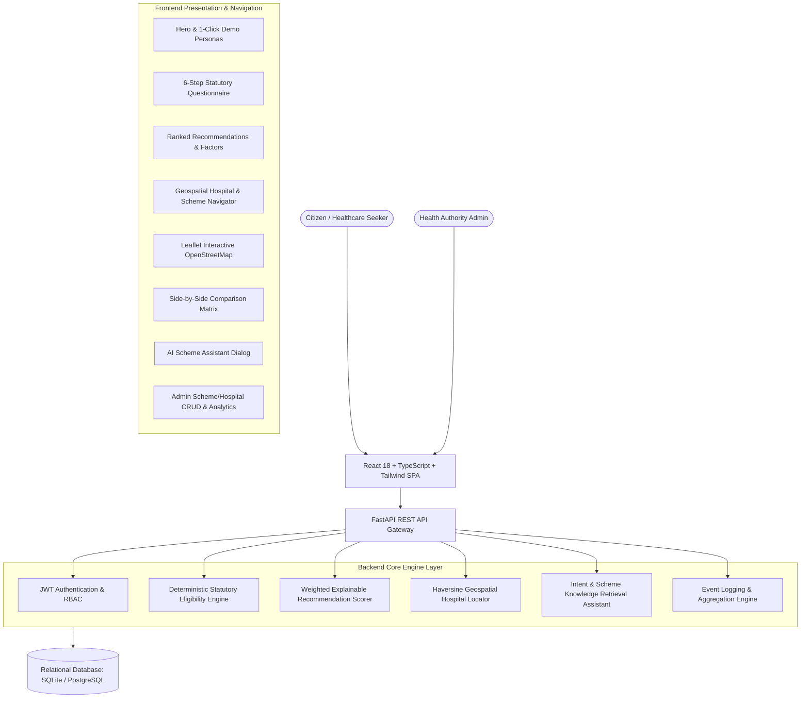

# System Architecture — Healthcare Schemes Navigator

## 1. High-Level Architecture

The **Healthcare Schemes Navigator** is designed with a modern decoupled architecture separating the presentation layer from backend analytical and geospatial micro-services.

---

## 2. Key Subsystems

### 2.1 Deterministic Rule Engine
Evaluates statutory qualifying criteria (Age brackets, Gender restrictions, Maximum annual income ceilings, BPL/SECC deprivation mandates, Geographic state domicile, Maternal status, Child health status) and returns unambiguous status (`ELIGIBLE`, `POTENTIALLY_ELIGIBLE`, `NOT_ELIGIBLE`) along with matched criteria and official caveats.

### 2.2 Explainable AI/ML Recommendation Model
Computes a normalized **0–100% Match Score** using a multi-factor weighted scoring model:
- **Statutory Rule Score (50%)**: Direct alignment with scheme criteria.
- **Healthcare Need & Urgency Score (20%)**: Alignment with hospitalization, maternal care, pediatric surgery, or oncology.
- **Demographic Score (10%)**: Age group and gender resonance.
- **Geographic Coverage Score (10%)**: State-specific availability.
- **Socioeconomic Tier Score (10%)**: Income level and vulnerability weighting.

### 2.3 Location-Based Hospital & Scheme Navigator ("Find Schemes Near You")
- **Hierarchy Navigation**: State → District → Taluka → Village/City → Hospital.
- **Bidirectional Lookup**:
  - `Scheme → Empanelled Hospitals`: Locates all network hospitals accepting a selected scheme.
  - `Hospital → Available Schemes`: Lists all active cashless government programs available at a specific hospital.
- **Haversine Geolocation**: Computes precise great-circle distance in kilometers using user GPS or selected district/taluka center coordinates.
- **Interactive OpenStreetMap**: Visual Leaflet map with custom hospital pins, 24x7 emergency badges, distance circles, and one-click Google Maps directions.

### 2.4 AI Healthcare Scheme Assistant
NLP-driven knowledge retrieval chatbot answering citizen questions regarding required documents (Aadhaar, Ration Card), application steps (Arogyamitra helpdesk), disease coverage, and nearby empanelled hospitals.
