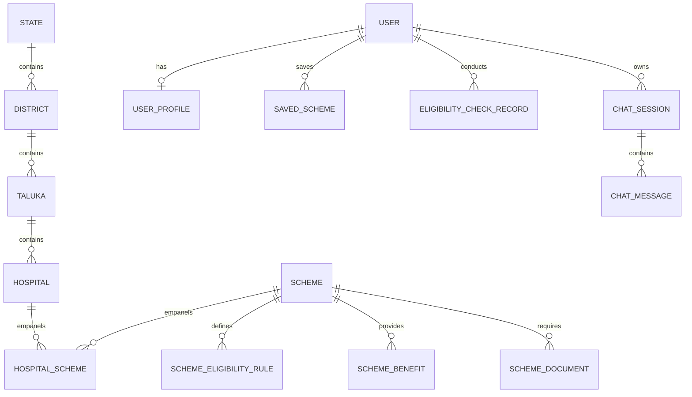

# Database Architecture & Entity Relations

The **Healthcare Schemes Navigator** utilizes a normalized relational schema built with SQLAlchemy ORM, compatible with both SQLite (for zero-config local development) and PostgreSQL (for production deployments).

---

## 1. Tables & Descriptions

| Table Name | Description | Key Indexes |
| :--- | :--- | :--- |
| `users` | Citizen and Administrator accounts | `email`, `role` |
| `user_profiles` | Citizen demographic, socioeconomic, and location preferences | `user_id`, `state`, `district` |
| `states` | Indian States and Union Territories | `name`, `code` |
| `districts` | Administrative districts within states | `state_id`, `name` |
| `talukas` | Sub-districts / Tehsils with default geographic coordinates | `district_id`, `name`, `pincode` |
| `schemes` | Central & State Government healthcare schemes | `slug`, `scheme_type`, `is_active` |
| `scheme_eligibility_rules` | Statutory criteria (age, gender, income, BPL, pregnancy) | `scheme_id` |
| `scheme_benefits` | Specific cash/cashless coverages and surgical packages | `scheme_id` |
| `scheme_documents` | Mandatory KYC and identity proofs required | `scheme_id` |
| `hospitals` | Verified public and private empanelled healthcare facilities | `state_name`, `district_name`, `taluka_name`, `latitude`, `longitude` |
| `hospital_schemes` | Junction table for Hospital ↔ Scheme empanelments | `hospital_id`, `scheme_id`, `status` |
| `saved_schemes` | Citizen bookmarked schemes | `user_id`, `scheme_id` |
| `eligibility_check_records` | Historical log of evaluations and top match scores | `user_id`, `created_at` |
| `chat_sessions` & `chat_messages` | AI scheme assistant conversation records | `session_uuid` |
| `analytics_events` | Aggregated telemetry and usage metrics | `event_type`, `created_at` |
