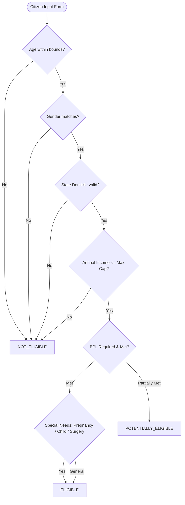

# Statutory Eligibility Rule Engine

## 1. Engine Objective

The **Deterministic Statutory Eligibility Engine** evaluates user inputs against official government guidelines established by the **National Health Authority (NHA)**, **Ministry of Health & Family Welfare (MoHFW)**, and **State Health Agencies (e.g. State Health Assurance Society, Maharashtra)**.

---

## 2. Evaluation Logic & Hierarchy

---

## 3. Scheme-Specific Statutory Rules Evaluated

1. **Ayushman Bharat PM-JAY**:
   - Central scheme, nationwide portability.
   - Requires BPL / SECC deprivation status or priority ration card.
   - Max income guideline: ₹2,50,000/yr (or listed in NFSA database).
   - Covers ₹5,00,000 per family per year for secondary/tertiary hospital care.

2. **Mahatma Jyotirao Phule Jan Arogya Yojana (MJPJAY - Maharashtra)**:
   - State scheme, requires Maharashtra domicile.
   - Covers Yellow / Orange ration card holders, Annapurna card, Antyodaya card, and registered farmers in distressed districts.
   - Coverage: ₹5,00,000 per family per year across 996+ medical packages.

3. **Pradhan Mantri Surakshit Matritva Abhiyan (PMSMA)**:
   - Covers pregnant women in 2nd and 3rd trimesters.
   - Assured, free, comprehensive antenatal checkups on 9th of every month.

4. **Janani Suraksha Yojana (JSY)**:
   - Safe institutional delivery cash assistance for pregnant BPL/SC/ST women (₹1,400 in rural, ₹1,000 in urban areas).

5. **Rashtriya Bal Swasthya Karyakram (RBSK)**:
   - Covers children from birth to 18 years (0 to 216 months).
   - Screening and free surgical correction for 4Ds: Defects at birth, Deficiencies, Diseases, and Developmental delays.

6. **Ayushman Bharat Health Account (ABHA / ABDM)**:
   - Open to all Indian citizens of all ages with zero income restriction.
   - Creates 14-digit unique digital health identity and consent-based health record exchange.
