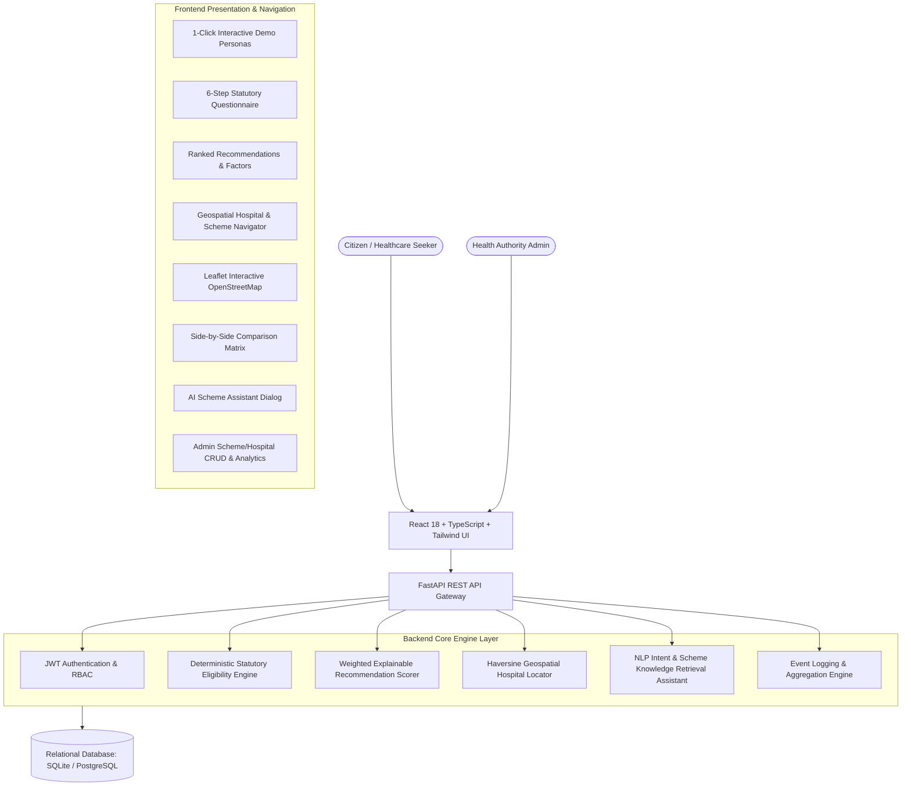

# 🏥 ArogyaNav — Healthcare Schemes Navigator & Location-Based Hospital Finder

[](https://fastapi.tiangolo.com)
[](https://react.dev)
[](https://www.typescriptlang.org)
[](https://tailwindcss.com)
[](https://leafletjs.com)
[-brightgreen.svg?style=flat&logo=pytest)](https://pytest.org)

> A production-grade, explainable full-stack web application empowering Indian citizens to discover government healthcare schemes, evaluate statutory eligibility, and locate verified empanelled network hospitals nearby.

---

## 🌟 Executive Summary & Problem Solved

Millions of Indian citizens fail to claim free inpatient healthcare, surgeries, and maternal entitlements simply because:
1. **Discovery Gap**: Unaware of which central or state programs they qualify for.
2. **Rule Ambiguity**: Complex statutory eligibility criteria (income caps, ration card tiers, state domicile, age brackets).
3. **Access Friction**: Knowing a scheme exists does not tell the citizen **which local hospital accepts it** or **where the nearest empanelled center is located**.

**ArogyaNav** solves all three challenges through a unified platform combining **deterministic rule evaluation**, **explainable AI/ML recommendation scoring (0–100%)**, and a **location-based geospatial hospital navigator ("Find Schemes Near You")**.

---

## 🏛️ System Architecture



---

## ✨ Key Features & Capabilities

### 1. 📋 6-Step Statutory Eligibility Questionnaire
- Intuitive wizard covering **Personal Demographics**, **Location Hierarchy** (State → District → Taluka), **Socioeconomic Status** (Income, BPL/Ration Card), **Family Profile**, and **Healthcare Need**.
- Real-time step validation and field guidance explaining why each parameter is evaluated.
- **1-Click Demo Persona Presets** for instant, flawless evaluation and live presentations.

### 2. 🧠 Explainable AI/ML Recommendation Scoring
- Multi-factor weighted recommendation algorithm (Statutory Rule 50%, Healthcare Need 20%, Demographics 10%, Location 10%, Socioeconomic 10%).
- Outputs normalized **0–100% Match Scores** with categorical tiers (*Highly Recommended*, *Good Match*, *Moderate Match*).
- **Point-by-point explainable reasons** (*Why this scheme matches you*) and **official verification warnings**.

### 3. 📍 Location-Based Hospital & Scheme Navigator ("Find Schemes Near You")
- **Cascading Geographical Hierarchy**: State → District → Taluka → PIN Code.
- **HTML5 Geolocation ("Use My GPS Location")** with automatic nearest facility detection.
- **Bidirectional Lookup**:
  - `Scheme → Hospitals`: Find all network hospitals accepting a specific scheme.
  - `Hospital → Schemes`: Discover all government schemes supported at a local hospital.
- **Interactive OpenStreetMap (Leaflet)** with customized markers, 24x7 emergency badges, distance calculation in km, and direct Google Maps directions.

### 4. ⚖️ Side-by-Side Scheme Comparison Matrix
- Compare up to 4 schemes across coverage limits, treatment modes (cashless vs reimbursement), administering ministries, eligibility criteria, mandatory KYC documents, and helplines.

### 5. 💬 ArogyaNav AI Healthcare Assistant
- Built-in conversational AI assistant providing instant guidance on required documents, application procedures, disease packages, and hospital helpdesk locations.

### 6. 📊 Citizen Dashboard & Health Authority Admin Portal
- **Citizen Dashboard**: Profile completion meter, saved/bookmarked schemes, recent eligibility evaluations log.
- **Admin Portal**: Platform usage analytics, Scheme CRUD, Hospital Registry CRUD, and **Bulk CSV Hospital Import** with schema validation.

---

## 👥 Interactive Demonstration Personas

Try the 1-click preset profiles on the Home and Eligibility pages:

| Persona | Demographics & Location | Medical Need | Top Recommended Scheme |
| :--- | :--- | :--- | :--- |
| **Anirudha Patil (Senior Citizen)** | Age 62, Male, BPL Yellow Card, Karvir (Kolhapur) | Hospitalization / Surgery | **Ayushman Bharat PM-JAY & MJPJAY** (₹5 Lakh Cashless Cover) |
| **Sunita Kamble (Young Mother)** | Age 26, Female, Pregnant, Karvir (Kolhapur) | Maternal & Antenatal Care | **PMSMA & Janani Suraksha Yojana (JSY)** (Free ANC & Cash Delivery) |
| **Aarav Shinde (Child Care)** | Age 6, Male, Hatkanangle (Kolhapur) | Pediatric Congenital Health | **Rashtriya Bal Swasthya Karyakram (RBSK)** (Free 4D Surgery) |

---

## 🛠️ Technology Stack

| Layer | Technologies |
| :--- | :--- |
| **Frontend** | React 18, TypeScript, Vite, TailwindCSS, Lucide Icons, Leaflet / React-Leaflet |
| **Backend** | Python 3.11, FastAPI, Pydantic v2, SQLAlchemy, Uvicorn, Bcrypt, PyJWT |
| **Database** | SQLite (Default for zero-config local run) / PostgreSQL (via Docker Compose) |
| **Geospatial** | Haversine Great-Circle Geolocation, OpenStreetMap Tiles, Leaflet.js |
| **Testing** | Pytest, HTTPX Async Client (10/10 automated tests passing) |
| **Containerization** | Docker, Docker Compose, Multi-stage Nginx builds |

---

## 🚀 Quickstart & Setup Guide

### Prerequisites
- **Python 3.10+**
- **Node.js 18+** (or npm)

---

### Step 1: Clone Repository
```bash
git clone https://github.com/your-username/healthcare-schemes-navigator.git
cd healthcare-schemes-navigator
```

---

### Step 2: Backend Setup
```bash
cd backend

# Create and activate virtual environment
python -m venv .venv
# On Windows:
.venv\Scripts\activate
# On Linux/macOS:
source .venv/bin/activate

# Install dependencies
pip install -r requirements.txt

# Run automated tests
pytest

# Start FastAPI backend server
uvicorn app.main:app --reload --port 8000
```
Backend API is live at `http://localhost:8000` (Swagger UI at `http://localhost:8000/docs`).
*Note: The SQLite database automatically seeds on first launch.*

---

### Step 3: Frontend Setup
```bash
# In a new terminal:
cd frontend

# Install packages
npm install

# Start Vite development server
npm run dev
```
Frontend Web Application is live at `http://localhost:5173`.

---

### 🐳 Docker Compose Deployment (1-Command Run)
```bash
docker-compose up --build
```
- Frontend: `http://localhost:5173`
- Backend API: `http://localhost:8000`
- PostgreSQL Database: `localhost:5432`

---

## 🧪 Automated Testing Verification

The backend includes comprehensive automated test coverage for eligibility algorithms, geospatial distance calculation, and REST endpoints:

```bash
cd backend
pytest -v
```

**Results**:
```
tests/test_api.py::test_health_check PASSED
tests/test_api.py::test_schemes_list PASSED
tests/test_api.py::test_scheme_detail PASSED
tests/test_api.py::test_location_hierarchy PASSED
tests/test_api.py::test_hospitals_search PASSED
tests/test_eligibility.py::test_pmjay_eligibility_bpl PASSED
tests/test_eligibility.py::test_rbsk_child_eligibility PASSED
tests/test_eligibility.py::test_maternal_eligibility PASSED
tests/test_hospitals.py::test_haversine_distance_calculation PASSED
tests/test_hospitals.py::test_hospital_scheme_bidirectional_mapping PASSED

======================== 10 passed in 2.38s =========================
```

---

## 📂 Project Directory Structure

```
Anirudha_healthcare_project/
├── backend/
│   ├── app/
│   │   ├── api/             # REST Routers (auth, schemes, eligibility, hospitals, locations, compare, chat, admin)
│   │   ├── core/            # Config, direct bcrypt security, SQLAlchemy database session
│   │   ├── models/          # SQLAlchemy Database Models (Scheme, Hospital, Location, User, Chat, Analytics)
│   │   ├── schemas/         # Pydantic v2 validation schemas
│   │   ├── seeds/           # Official Indian scheme & hospital empanelment seed data
│   │   ├── services/        # Business logic: Rule Engine, Recommendation Scorer, Hospital Locator, Chatbot
│   │   └── main.py          # FastAPI application entrypoint with lifespan startup
│   ├── tests/               # Pytest automated test suite
│   ├── requirements.txt
│   └── Dockerfile
├── frontend/
│   ├── src/
│   │   ├── components/      # UI components: Navbar, Footer, SchemeCard, HospitalCard, MapView, Stepper, etc.
│   │   ├── context/         # AuthContext, LocationContext
│   │   ├── pages/           # Home, Questionnaire, Results, Hospitals, Schemes, Compare, Dashboard, Admin, Auth
│   │   ├── services/        # Axios API client
│   │   ├── types/           # TypeScript interfaces
│   │   ├── App.tsx          # Main application router and state
│   │   └── main.tsx         # React DOM root
│   ├── package.json
│   ├── vite.config.ts
│   ├── tailwind.config.js
│   └── Dockerfile
├── docs/                    # Architecture, API, Database, Recommendation, and Eligibility docs
├── docker-compose.yml       # Production multi-container composition
├── .env.example
└── README.md
```

---

## 🔐 Default Credentials

| Account Role | Email | Password |
| :--- | :--- | :--- |
| **Demo Citizen** | `citizen@demo.in` | `demo123` |
| **System Administrator** | `admin@healthcare.gov.in` | `admin123` |
| **Guest Citizen** | No login required (Click *"Continue as Guest"*) | N/A |

---

## 📜 Official Data Attribution & Disclaimers

1. **Information Source**: Healthcare scheme guidelines, benefit structures, and empanelment criteria are grounded in official documentation published by the **National Health Authority (NHA)**, **Ministry of Health and Family Welfare (MoHFW)**, **Ayushman Bharat Digital Mission (ABDM)**, and **State Health Assurance Society (Maharashtra)**.
2. **Informational Purpose**: ArogyaNav is a public-interest navigation, educational, and decision-support platform. It does not replace clinical consultation, medical diagnosis, or statutory verification performed by hospital Arogya Mitras and government welfare offices.
3. **Privacy Assurance**: All citizen eligibility calculations can be executed entirely client-side/in-memory as a guest. No Aadhaar numbers or confidential banking records are stored or transmitted.

---

## 👨‍💻 Project Developer & Contact

**Developed by**: Anirudha Patil  
**Project**: Final-Year Engineering / Smart India Hackathon Demonstration  
**License**: MIT License
